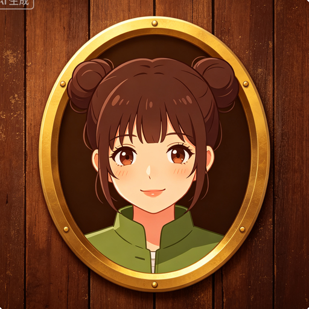
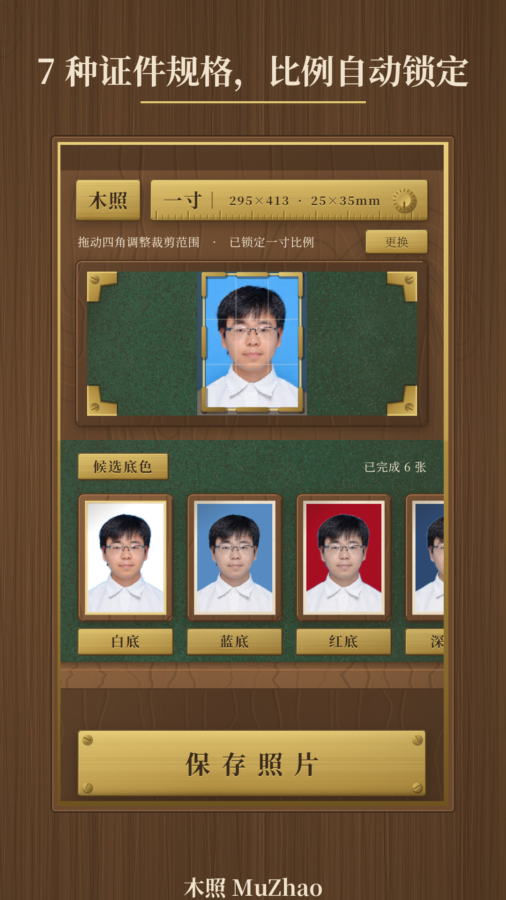
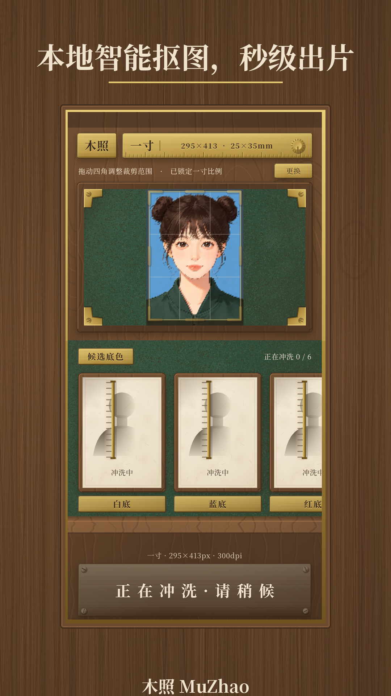
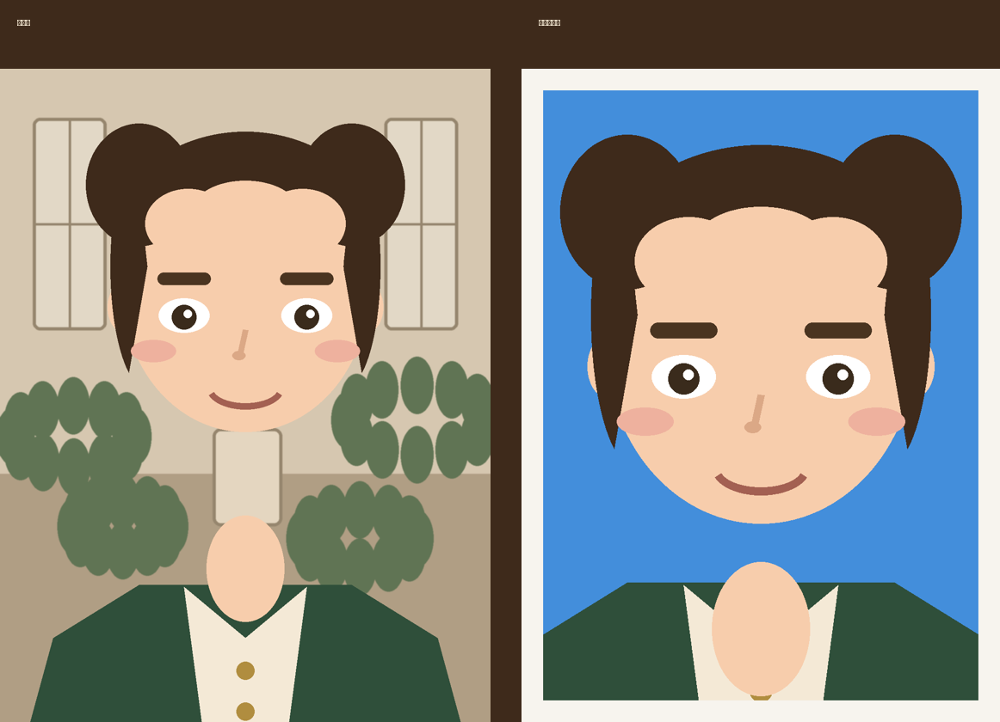

# 木照 MuZhao

<p align="center">
  
</p>

**复古木制 · 完全离线 · 免费无水印** 的证件照制作工具。

拍照或从相册选一张人像照片，木照在**你的设备上**完成抠图、按规格裁剪、
换底色、写 300DPI 元数据——照片永不离开你的设备。

<p align="center">
  
  
</p>

## 特性

| | |
|---|---|
| 🔒 **100% 离线** | 无网络权限、无统计、无广告 SDK——卖点即红线 |
| ✂️ **端侧 AI 抠图** | MODNet int8（7.2MB）+ YuNet 人脸检测，发丝级 alpha |
| 📐 **7 种规格** | 一寸/小一寸/大一寸/二寸/小二寸/社保卡/美签，像素级精确 |
| 🎨 **6 种底色** | 白/蓝/红/深蓝/浅灰/蓝渐变，去色边处理不溢色 |
| 🖨️ **300 DPI** | JFIF 元数据写入，打印即用 |
| 🪵 **复古木制 UI** | 程序化木纹/黄铜/绒布材质，像 1930 年代照相馆的工作台 |
| 🚫 **免费无水印** | 无内购、无水印、无追踪 |

<p align="center">
  
</p>
<p align="center"><sub>效果示意 · 吉祥物"木木"（原创卡通形象，非真实照片）</sub></p>

## 下载

前往 [Releases](https://github.com/liuyuanlin/idphotos/releases) 下载最新 Android APK。

| 平台 | 状态 |
|---|---|
| Android 8.0+ | ✅ 发布 |
| Windows | 🚧 开发中（Flutter 跨平台） |

## 构建

```bash
flutter pub get
flutter build apk --release        # Android
flutter build windows --release    # Windows（开发中）
```

要求：Flutter 3.x stable、Android SDK（Android 构建）、JDK 17。

## 技术栈

Flutter / Dart 3 · Riverpod · onnxruntime（自建 FFI 层，MODNet + YuNet）· 
Dart `image` 包（几何/合成/JFIF）· 纯本地推理，无任何云依赖。

## 隐私

不收集、不传输、无网络权限——详见 [隐私政策](store/privacy_policy_zh.md)。

## 许可

代码以 [MIT](LICENSE) 许可发布 · 字体 [Noto Serif SC](https://fonts.google.com/noto/specimen/Noto+Serif+SC)（SIL OFL 1.1）· 模型权重遵循其原始许可

**作者：刘沅林**
